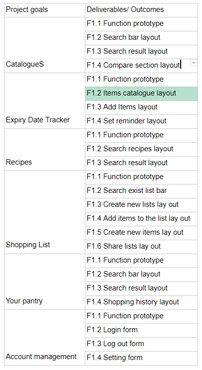

# SoupafoodsA3
<h2>Project Background</h2>

<h3>Motivation</h3>

 The project we are looking for should be practical and can be completed with our current knowledge and technology.
The idea of managing your groceries seems to fulfill both of these requirements. Therefore we chose this project. 
Furthermore, we figured that this application can assist in solving day to day issues such as food wastage,
money mismanagement and will help you to be more efficient when you go out to buy groceries.

After the discussion we find that this app could actually help us in our own lives as most of the group members do their
own grocery shopping and have resonated that they do have the problems that this application sets out to fix. This fact
greatly motivated us to choose this project because we realized this application does have a lot of practical benefits.

The idea for this project seemed as if it could be done with our individual skills that we currently possess. It didn't seem too far 
fetched or technologically impossible.That being said, most of us are not exactly experienced so this app will give us the opportunity
to go beyond what we know and can do.In terms of enriching our IT skills, this project gives opportunity for all types of IT skills 
ranging from coding to designing as both the back-end and front-end development of this app is extremely important.

The idea behind this project was born in Introduction to IT. The original application started off as a gadget that scans expiration dates 
which then deposits the date and the item name into a repository of items that was on a mobile app. After further thought and helpful
feedback from the tutor, the group decided to change the whole idea from a connected gadget and app to a more fleshed out and feature packed 
standalone mobile application. This was done mainly because that it was understood based on the feedback we got that developing this app to 
work with another gadget seemed too complicated especially at that level. Therefore with the tutor's feedback in mind, the project idea was reformed. 
This version of that project is more in line with the idea we decided on for our project. This included many of the features that were 
going to be added to the original project.

<h3>Scope</h3>

<h3>Challenges and learning</h3>
<h3>-What I find easy</h3>

Yiyang:I think the design part is much easier than I anticipated, because my last experience in using figma is a disaster,everyone is in charge of one MVF, and my part is the shopping list feature. Firstly I don’t know where to start but after the meeting with Dr.B, he gave us a very useful suggestion: find a similar application on the market and study it. The one I found is called Anylist and after using it for 30 minutes, I know where to start and I think I did a good job.

<h3>-What I find difficult</h3>

Yiyang:The difficult part I think is the web programming part, firstly I don’t know how to use AWS as I only used Github before,  so I didn’t contribute much on HTML coding  and zero on CSS coding. So I did some research which cost me a huge amount of time.The other difficulty I am facing is the time difference, I’m currently studying in China now so two hour difference has made me exhausted and I always feel sleepy  during the early morning courses.

<h3>-What is unexpected</h3>

Yiyang:The assignment requires us to make a fully functional application, but with our current  knowledge and experience it’s almost impossible for us to do that. Especially our expectation for this application is extremely high so we have to replace some complex features with the easier one.

<h3>-What challenge am I expecting & how we address it</h3>

Yiyang:The challenge I am expecting is since we are doing online courses now, the communication part is going to be more difficult than usual especially for the group meeting. It’s inevitable that some of the members in the group are going to miss the meeting, I did it one time but thanks to the recording and the summary I catch up quickly.

<h3>-What are the new skills or experience you have learned and/or developed?</h3>

Yiyang:Using Figma is not my new skills, as I used it last year, but in this assignment I spend most of time in prototyping which made me more familiar with Figma beside that I also learned how to use Invision(another prototyping application) and use trello board to do the weekly stand up meeting.

<h3>-Was our timetable realistic</h3>

Yiyang:From my point of view, after the challenge we have faced I think the original timetable is obviously not realistic, we separated the assignment into different tasks and everyone took different tasks some are in charge of reporting some are in charge of coding or designing so clearly we don’t have much communication, and we can hardly learn new skills from each other. Maybe next time we could spend more time on communication and everyone can try something different, get out of our comfort zone inside of just doing tasks individually.

<h3>Project Process</h3>

One important thing I learnt in this group project was that it is essential that every team member can have different skills and knowledge because I think it’s easier  for us to learn from each other during the process, so when we finish the project we can actually learn more than one new skill. As for what we did well, I think our workload is very balanced and we can see exactly what everyone’s tasks are and deadlines on the Trello board. However, as a group I think we were lacking communication, maybe we were still uncomfortable with communicating purely online.

Our mentor kept holding weekly stand-up meetings which push us to finish our tasks in time. And Dr.B told us to find some similar applications on the market and learn from them which led us to the right direction and we had a very good start.  As for the communication tools, we mainly communicated through Teams, facebook and wechat. We held group meetings once or twice a week in the Teams, some members may not be able to attend the meetings due to the different time table or time zone, but Teams has a recording function so we can save meetings  and others can catch up easily. Apart from that members who can’t attend meetings can avoid missing important decisions by watching the summary.  Our group’s main communication process through Teams, facebook and wechat hasn't changed since the beginning of this semester.

The most important aspect of organising this project is to find achievable MVFs. In the beginning of the project we spent a long time describing the MVFs which made those MVFs too fancy and impossible for us to achieve the ultimate goal -- working prototype. If we could start again, we will definitely make our MVFs much easier and can be achieved with our current skills and ability.

The advice I would give to other groups is to improve their current programing and design skills as this project can not be easily achieved.

